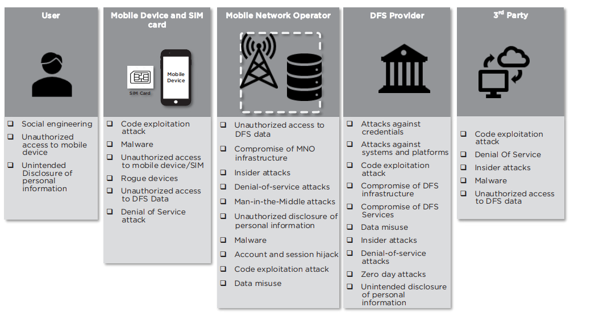

# Security threats

## Threats to DFS using USSD, SMS, IVR, STK and NSDT 

The diagram below summarises the threats of DFS applications based on USSD, SMS, IVR, STK and NSDT.

<figure><figcaption>
Threats to DFS systems using USSD, SMS, IVR and NSDT
</figcaption></figure>

## Threats to DFS ecosystem based on apps and digital wallets&#x20;

Mobile payment applications/wallets enable digital financial services through applications installed on the mobile device, the nature of financial applications and channels used will depend on the device capabilities, for example Samsung pay and Apple pay only for Samsung devices and Apple devices, whereas Google Pay can be used on all android devices, mobile payment applications utilizing Quick Response codes like WeChat Pay and AliPay can be used by all smartphones with a camera.​

<table data-header-hidden><thead><tr><th width="253">Element</th><th>Threats</th></tr></thead><tbody><tr><td>Mobile Payment application</td><td>
• Reverse engineering the application source code

• Tampering with the mobile payment application

• Exploit of mobile payment application vulnerabilities

• Installation of rootkits/malware

• Mobile Operating System Access Permissions
</td></tr><tr><td>Mobile Device</td><td>
• Installation of rogue applications and malware

• Unauthorized access to lost or stolen mobile device

• Malware installation on the device
</td></tr><tr><td>Merchant Threats</td><td>
• OS malware: Attackers may upload POS malware on POS devices that could be used to remotely access and payment data.

• QR code compromise: QR codes have inherent threats because they are not easily readable by the human eye, attackers could easily replace a merchants QR code with nefarious codes that could be embedded with malicious content. The malicious content may be phishing URLs, malicious mobile apps.

• Man-in-the-Middle attacks against POS contactless terminal and POS server: attackers can exploit network security weaknesses such as lack of firewalls to protect the merchants’ internal network.

• Relay attacks against NFC enabled POS contactless terminals: Relay software installed on a mobile device can relay commands and responses between the Secure Element and a card emulator that is installed as a proxy on the mobile POS across a wireless network.

• Use of default PINs to access POS terminals e.g. default 166816 and Z66816 (1)
</td></tr><tr><td>Acquirers</td><td>
• Payment processing systems compromise: When requesting tokens and cryptograms from the issuer payment network, an attacker can obtain a large amount of cardholder data by installing malware and remote access tools at any of the internal network payment processing servers.

• Network and interface security compromise, attackers may exploit insecure point-to-point connections between the acquirer and issuer by compromising the network provider, attackers can then use this level of access to be able to monitor and manipulate API calls.
</td></tr><tr><td>Payment Service Provider</td><td>
• Compromise of payment gateways: payment gateways can be targeted by attackers with the intent of accessing and compromising the transaction data in transit from merchants to acquiring banks.

• Compromise of software vulnerabilities in POS contactless terminals that are provided to merchants by PSPs that can process data from different channels including Card present, contactless payments, and card not present.

• Compromise of insecure networks; attackers could perform Man in the middle attacks to spoof sensitive data in transit from the PSP to the acquirer is the provider is using weak or insecure connections like lower versions of TLS and SSL.

• Design flaws and unpatched software vulnerabilities in POS terminal machines and POS systems and payment gateways to/from acquirers
</td></tr><tr><td>Issuers</td><td>
• Payment processing systems compromise: When requesting tokens and cryptograms from the issuer payment network, an attacker can obtain large amount of cardholder data by installing malware and remote access tools at any of the internal network payment processing servers.

• Network and interface security compromise, attackers may exploit insecure point to point connections between the acquirer and issuer by compromising the network provider, attackers can then use this level of access to be able to monitor and manipulate API calls.
</td></tr></tbody></table>

Digital payment applications communication between the device/application and the payment provider is mainly reliant on internet channel through Wi-Fi, 3G and 4G networks, and/or a payment can be effected to a merchant Point Of Sale device using Magnetic Secure Transmission, scanning a Quick Response code or Near Field Communication (NFC).The use of these channels presents other threats and elements (POS, Acquirers, Payment Network Providers, Card issuers, Mobile Payment providers). Based on these components, we identify the following threats to DFS ecosystem based on mobile applications and wallets (i.e. Android, iOS).Based on the stakeholders within the DFS ecosystem, we consider merchants, acquirers, payment service providers, and issuers to be third-party providers (we show these individual entities in the expanded figure of the DFS ecosystem in Annex 1). While we list the general threats that these entities face here, the specific mitigations for addressing the threats that they face are out of scope for this document. We recommend consulting the PCI-DSS and the Cyber Resilience Oversight Expectations for Financial Market Infrastructures report\[i] to read more about mitigations.\
